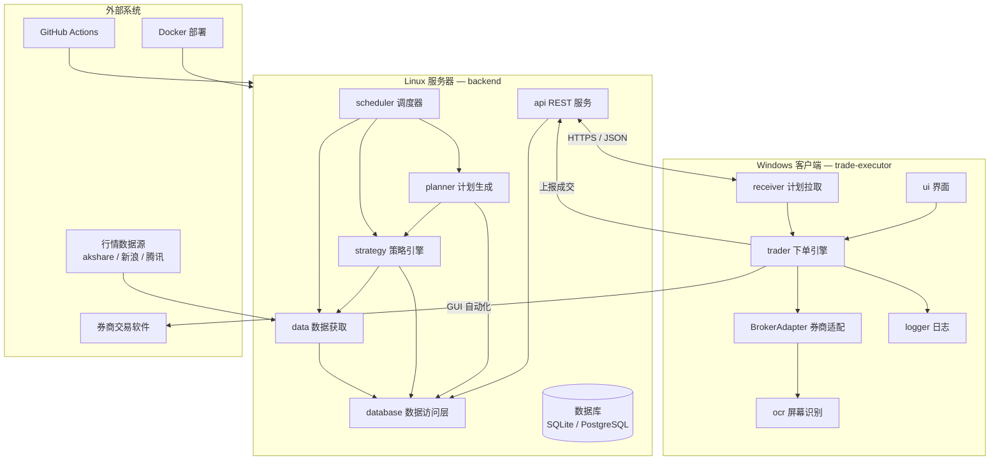
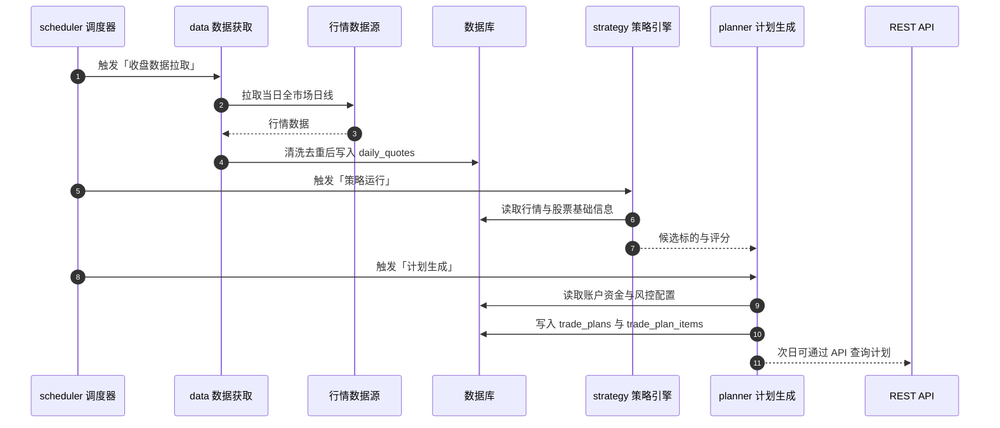
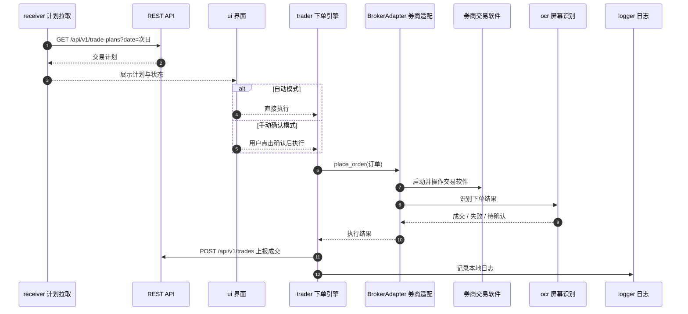
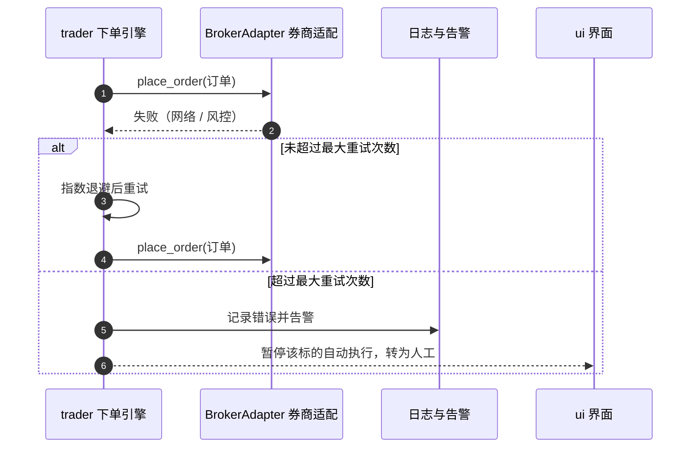

# 系统架构设计文档

> 版本：v0.1（草稿）　|　日期：2026-08-07　|　状态：待评审
> 关联文档：[PRD-需求文档.md](PRD-需求文档.md)、[数据库设计文档.md](数据库设计文档.md)、[REST-API-设计文档.md](REST-API-设计文档.md)

---

## 1. 架构目标与原则

### 1.1 架构目标
1. 实现 PRD 中 v1.0 全流程闭环：**收盘自动分析 → 次日自动交易 → 全量日志与报告**。
2. 支持多 Agent 协作开发：模块边界清晰、接口稳定、可独立测试与交接。

### 1.2 设计原则

| 原则 | 说明 |
|------|------|
| 前后端分离 | Linux 后端只负责「分析决策」，Windows 执行器只负责「执行与反馈」 |
| 协议先行 | 跨端交互以 `shared/` 中定义的数据结构与 REST 契约为准 |
| 策略插件化 | 新增策略不修改核心流程，按目录注册即可 |
| 券商隔离 | 执行器通过 `BrokerAdapter` 接口对接不同券商客户端 |
| 可观测性 | 所有关键事件写入结构化日志，可审计、可追踪 |
| 默认安全 | 凭据不明文落盘，对外接口强制鉴权 |

---

## 2. 总体架构图



---

## 3. 模块划分与职责

### 3.1 backend（Linux 策略服务器）

| 模块 | 目录 | 职责 |
|------|------|------|
| 调度器 | `backend/app/scheduler` | 定时触发收盘数据拉取、策略运行、计划生成、报告生成 |
| 数据获取 | `backend/app/data` | 拉取行情/基础信息/财务数据，清洗、校验、落库 |
| 策略引擎 | `backend/app/strategy` | 执行选股策略，输出候选标的与评分 |
| 计划生成 | `backend/app/planner` | 结合资金与风控规则生成交易计划 |
| REST API | `backend/app/api` | 对外提供计划、成交、报告等接口 |
| 数据访问 | `backend/app/repository` | ORM 模型、Repository、迁移脚本 |
| 配置安全 | `backend/app/core` | 环境配置、密钥管理、日志 |

### 3.2 trade-executor（Windows 执行器）

| 模块 | 目录 | 职责 |
|------|------|------|
| 计划拉取 | `trade-executor/executor/receiver` | 定时从后端拉取当日计划并缓存 |
| 下单引擎 | `trade-executor/executor/trader` | 校验计划、调用适配层、执行下单、重试 |
| 券商适配 | `trade-executor/executor/trader/adapters` | 封装具体券商客户端的自动化操作 |
| 屏幕识别 | `trade-executor/executor/ocr` | OCR 识别交易软件界面，确认成交 |
| 界面 | `trade-executor/executor/ui` | 状态展示、手动确认、暂停/恢复 |
| 日志 | `trade-executor/executor/logger` | 本地结构化日志 + 回传后端 |

### 3.3 shared（共享层）

| 内容 | 说明 |
|------|------|
| 数据结构 | `TradePlan`、`TradeReport`、`Report` 等模型 |
| 枚举 | `Side`、`PlanStatus`、`OrderStatus`、`ErrorCode` |
| 常量 | 交易时间、重试参数、接口路径 |
| 时间规范 | 日期 `YYYY-MM-DD`（Asia/Shanghai），时间 ISO8601 |

---

## 4. 模块接口定义

### 4.1 backend 内部接口

```python
# data 模块
def fetch_daily(code: str, start: date, end: date) -> list[Bar]: ...
def fetch_stock_basics() -> list[Stock]: ...
def save_quotes(bars: list[Bar]) -> int: ...

# strategy 模块
class BaseStrategy:
    def run(self, ctx: StrategyContext) -> list[Candidate]: ...

# planner 模块
def build_plan(plan_date: date, candidates: list[Candidate], account: Account) -> TradePlan: ...

# repository 模块
def save_plan(plan) -> int: ...
def get_plan(plan_date: date) -> TradePlan | None: ...
def save_trade(fill: TradeReport) -> int: ...
```

### 4.2 trade-executor 内部接口

```python
receiver.pull_plan(plan_date: date) -> TradePlan
trader.execute(item: TradePlanItem) -> ExecutionResult
adapter.login(credentials) -> None
adapter.place_order(order: Order) -> BrokerOrderId
adapter.query_position(code: str) -> Position
ocr.recognize(region: Rect) -> ScreenState
logger.record(event: dict) -> None
logger.report_to_backend(day_report: Report) -> None
```

### 4.3 跨端契约（shared）

`trade_plan.json` 示例：

```json
{
  "plan_date": "2026-08-07",
  "items": [
    {
      "item_id": 10,
      "code": "600000",
      "side": "buy",
      "quantity": 100,
      "price_min": 10.50,
      "price_max": 11.00,
      "expire_at": "2026-08-08T09:35:00+08:00",
      "reason": "均线多头排列"
    }
  ]
}
```

---

## 5. 关键时序图

### 5.1 收盘后自动分析流程（每个交易日 15:30 触发）



### 5.2 执行器自动下单流程（次日开盘）



### 5.3 下单失败重试与告警



---

## 6. 通信协议设计

- 传输：HTTPS + JSON；认证：`Authorization: Bearer <api-key>`
- 版本：URL 前缀 `/api/v1`
- 时区：Asia/Shanghai

| 错误码 | 含义 |
|--------|------|
| 0 | 成功 |
| 1001 | 鉴权失败 |
| 1002 | 参数错误 |
| 2001 | 计划不存在 |
| 2002 | 计划已过期或不可执行 |
| 3001 | 行情数据缺失 |
| 4001 | 重复上报（幂等冲突） |
| 5000 | 服务器内部错误 |

---

## 7. 部署视图

- **backend**：docker-compose（api + scheduler + db），可选 systemd 直跑；
- **trade-executor**：Windows 本地安装（Python venv 或打包 exe），配置文件 `config.toml`；
- **CI**：GitHub Actions 在每次 push 运行单元测试与集成测试。

---

## 8. 安全设计

1. API Key 只存哈希，可单独吊销；
2. 券商凭据保存在 Windows 本机加密存储，后端不接触；
3. 日志脱敏：不打印完整 Key、密码、资金账号；
4. 所有对外接口强制鉴权，生产环境强制 HTTPS。

---

## 9. 可扩展性设计

- 策略：在 `backend/app/strategy/plugins/` 放置新策略文件即自动发现；
- 券商：实现新的 `BrokerAdapter` 子类即可接入新券商；
- AI 增强（v1.0 之后）：在 planner 与报告链路预留 risk / news / optimizer 扩展点。

---

## 10. 技术选型

| 层 | 技术 |
|----|------|
| 后端语言 | Python 3.11+ |
| API 框架 | FastAPI + Uvicorn |
| ORM / 迁移 | SQLAlchemy 2.0 + Alembic |
| 任务调度 | APScheduler |
| 数据源 | akshare（可替换） |
| 数据库 | SQLite（开发）/ PostgreSQL 15+（生产） |
| 测试 | pytest + httpx |
| CI | GitHub Actions |
| 部署 | Docker / docker-compose |
| 执行器 | Python + PySide6 + pyautogui + PaddleOCR（可选 Tesseract） |
| 契约 | Pydantic + OpenAPI（见 REST API 设计文档） |

---

## 11. 目录结构（v0.1 目标）

```
stock-agent/
├── backend/
│   ├── app/
│   │   ├── api/           # 路由与依赖
│   │   ├── core/          # 配置、安全、日志
│   │   ├── data/          # 数据获取
│   │   ├── strategy/
│   │   │   ├── base.py
│   │   │   └── plugins/   # 内置策略
│   │   ├── planner/       # 计划生成
│   │   ├── scheduler/     # 定时任务
│   │   ├── repository/    # 数据访问
│   │   └── models/        # ORM 模型
│   ├── migrations/        # Alembic
│   ├── tests/
│   ├── Dockerfile
│   └── pyproject.toml
├── trade-executor/
│   ├── executor/
│   │   ├── receiver/
│   │   ├── trader/
│   │   │   └── adapters/
│   │   ├── ocr/
│   │   ├── ui/
│   │   └── logger/
│   ├── tests/
│   └── pyproject.toml
├── shared/
│   ├── models.py
│   ├── enums.py
│   └── constants.py
├── docs/
├── examples/
└── README.md
```
